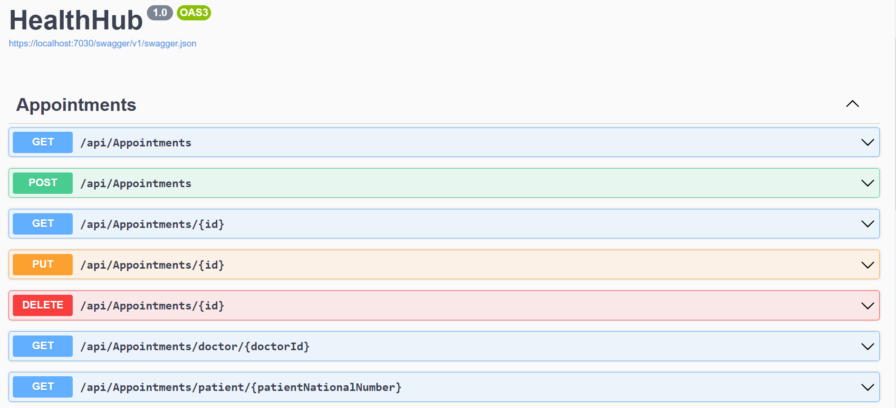

# Exercises - Part 3 - ASP.NET Core Razor Pages & Rest Api

## Razor Pages - ContactManager Application
In this Razor Pages web app we will make an application to manage all the contact and company information of our contacts. 
 

The solution contains a [layered architecture](https://www.oreilly.com/library/view/software-architecture-patterns/9781491971437/ch01.html) (see Programming Advanced next semester!) containing 5 projects:

* **AppLogic**: this project contains the application/'business' logic of the webapp. In the folder Contracts you can find the interfaces that are used in the application. 
* **Domain**: Contact and Company are the domain classes of this solution. 
* **Infrastructure**: This project contains the *implementation* of the repositories and DbContext of the application. In these repositories an actual database should be used for the contacts and companies. 
* **Tests**: The GUTS unit (and integration) tests.
* **Web**: The .NET Core Razor Pages project that should generate the website by using Razor Pages and the Domain and AppLogic projects.

If the user starts the application or clicks the Home button, the Home page will show.
This shows the information about all contacts in the database. In the last column, the name of the Company of the contact is shown.

When the user clicks the Add Contact button, the following page will appear:

There are input fields to enter all the information about a contact. 
At the bottom, the user has to select an existing company from a select list.
If the company of the new contact is not in the list, the user can add the company by clicking the Add Company button at the top of the page.

When clicking the Save button, the Company will be saved in the database and the new company can be selected from the dropdownlist of a new Contact.

Do not forget to add the necessary code in Program.cs for Dependency Injection!   

**Let the automatic tests guide you into understanding the intent of the code and into completing the code.**

**Make sure that String properties in the domain class have a maxLength, otherwise you will experience problems when creating and executing migrations.**

 
 

## WebApi - HealthHub Api
Create an Asp.Net Core Rest Api- application 

The solution contains a [layered architecture](https://www.oreilly.com/library/view/software-architecture-patterns/9781491971437/ch01.html) (see Programming Advanced next semester!) containing 5 projects:

* **AppLogic**: this project contains the interfaces that are used in the application. 
* **Domain**: Doctor, Specialty and Appointment are the domain classes of this solution. 
* **Infrastructure**: This project contains the *implementation* of the repositories and DbContext of the application. In these repositories an actual database should be used for the doctors, the specialties and the appointments.
* **Tests**: The GUTS unit (and integration) tests.
* **HealthHub**: The .NET Core Web Api project that should generate the website by using Web Api and the Domain and AppLogic projects.

 
When creating the database, following seed data will be added:

<ins>Specialties</ins>: 
Id = 1 - Name = "Cardiology" 
Id = 2 - Name = "Dermatoloty" 
Id = 3 - Name = "Orthopedics" 
Id = 4 - Name = "Neurology" 
Id = 5 - Name = "Pediatrics" 

<ins>Doctors</ins>: 
Id = 1 - FirstName = "Sophie" - LastName="Van Damme" - Email="dr.sophie.vandamme@example.com" - Phone="+32 479 12 34 56" - SpecialtyId=1} 
Id = 2 - FirstName = "Thomas" - LastName = "De Vos" - Email="dr.Thomas.Devox@example.com" - Phone="+32 473 98 76 54" - SpecialtyId = 1} 
Id = 3 - FirstName = "Marie" - LastName = "Dubois" - Email="dr.Marie.Dubois@example.com" - Phone="+32 488 11 11 11" - SpecialtyId = 2} 
Id = 4 - FirstName = "Axl" - LastName = "Moreau" - Email = "dr.Axl.Moreau@example.be" - Phone="+32 488 22 22 22" - SpecialtyId = 3 } 
Id = 5 - FirstName = "Peter" - LastName = "McHealer" - Email = "dr.Peter.Mchealer@example.be" - Phone="+32 499 33 33 33" - SpecialtyId = 3 } 
Id = 6 - FirstName = "Kate" - LastName = "Grant" - Email = "dr.Kate.Grant@example.be" - Phone="+32 473 55 55 55" - SpecialtyId = 3 } 
Id = 7 - FirstName = "Simon" - LastName = "De Jong" - Email = "dr.Simon.DeJong@example.be" - Phone="+32 474 66 66 22" - SpecialtyId = 4 } 
Id = 8 - FirstName = "Bryan" - LastName = "De Vries" - Email = "dr.Bryan.Devries@example.be" - Phone="+32 475 77 77 77" - SpecialtyId = 5 } 

<ins>Appointments</ins>: 
Id = 9999 - DoctorId=1 - AppointmentDate=DateTime.Today - PatientNationalNumber="111111" - Reason="reason" 

The Web Api application has to contain the following endpoints:

**Doctors Endpoints**

* **GET /api/Doctors**: fetches all the Doctors in the database
* **GET /api/Doctors/{id}**: fetches a doctor with a given id
* **GET /api/Doctors/specialty/{specialtyId}**: fetches all the doctors in the given specialty id.
* **POST /api/Doctors**: adds a doctor in the database. Provide the firstname, lastname, email, phone and specialty id of the doctor in the body of the post request
* **PUT /api/Doctors/{id}**: updates a doctor with a given id. Provide the doctor object in the body of the post request
* **DELETE /api/Doctors/{id}**: deletes a doctor with the given id in the database

**Appointments Endpoints**
* **GET /api/Appointments**: fetches all the appointments in the database
* **GET /api/Appointments/{id}**: fetches an appointment with a given id
* **GET /api/Appointments/doctor/{doctorId}**: fetches all appointments of a given doctor
* **GET /api/Appointments/patient/{patientNationalNumber}**: fetches all appointments of a given patient
* **GET /api/Appointments/upcoming**: fetches all upcoming appointments
* **POST /api/Appointments**: adds an appointment in the database. Provide an appointment data, a doctor id, a national number of a patient and a reason in the body of the request
* **PUT /api/Appointments/{id}**: updates an appointment with a given id. Provide the appointment object in the body of the post request
* **DELETE /api/Appointments/{id}**: deletes an appointment with the given id in the database

**Let the automatic tests guide you into understanding the intent of the code and into completing the code.**

